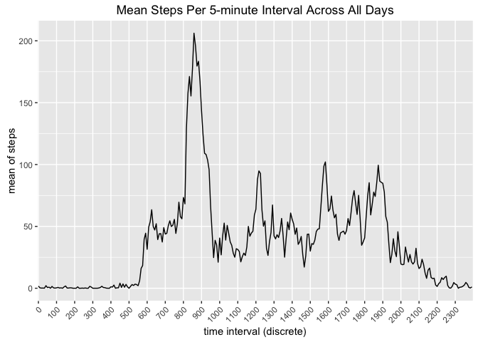
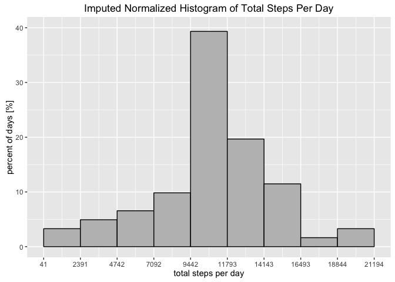
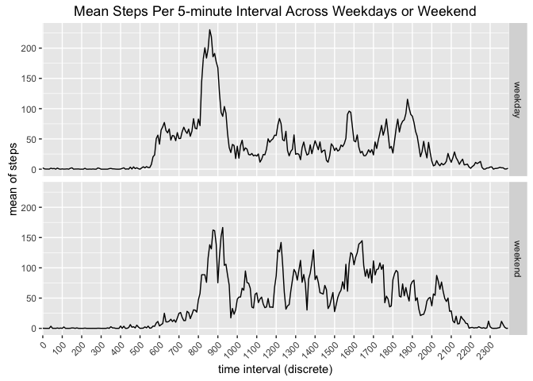

# Reproducible Research: Peer Assessment 1


## Loading and preprocessing the data


File "activity.zip" was downloaded (on: **Sat Jan 23 22:13:46 2016**) and unzipped to
"activity.csv".


```r
activity <- tbl_df(read.csv("activity.csv"))
```


## What is mean total number of steps taken per day?

Any NAs in the data were omitted, the total steps taken per day were
calculated and plotted as a histogram:


```r
dailyActivity <- na.omit(activity) %>% group_by(date) %>%
    summarize(totalSteps = sum(steps))
```


The total number of steps taken per day have a mean of 
**10766.19** and a median of **10765**.


## What is the average daily activity pattern?

To calculate the daily activity pattern, NAs were ommited, and the average
number of steps per interval was calculated and plotted as a line graph:


```r
intervalActivity <- na.omit(activity) %>% group_by(interval) %>%
    summarize(meanSteps = mean(steps))
```




The 5-minute interval **835** contains the maximum number
of steps on average across all the days.


## Imputing missing values


The activity dataset contained **2304** rows with at least one NA.
In a new dataset, these NAs were imputed using the above calculated mean steps
of the corresponding interval.


```r
imputedActivity <- left_join(activity, intervalActivity) %>%
    mutate(imputedSteps = ifelse(is.na(steps),
                                 meanSteps,
                                 steps)) %>%
    select(date, interval, imputedSteps)
```

The total steps taken per day were recalculated and plotted as a histogram using
the new dataset.


```r
imputedDailyActivity <- group_by(imputedActivity, date) %>%
    summarize(totalSteps = sum(imputedSteps))
```




The total number of steps taken per day for the imputed dataset have a mean of 
**10766.19** and a median of
**10766.19**, and are almost unchanged from the values reported
for the original dataset. In contrast, the histogram shows a clearly higher
percentage of days around the mean total step count for the imputed dataset than
for the original.


## Are there differences in activity patterns between weekdays and weekends?

The date of the dataset was parsed into the categories "weekday" or "weekend":


```r
# Use lubridate to parse dates...
imputedActivity <- mutate(imputedActivity, date = ymd(date)) %>%
    # ...and weekdays to determine day of the week...
    mutate(day = weekdays(date)) %>%
    # ...which is used to determine weekday or weekend.
    mutate(workOrFree = as.factor(ifelse(day %in% c("Saturday","Sunday"),
                                         "weekend",
                                         "weekday"))) %>%
    # Group...
    group_by(workOrFree, interval) %>%
    # ...to calculate the mean steps for each interval for either weekday/end.
    summarize(meanSteps = mean(imputedSteps))
```

This dataset was then used to determine the average daily activity pattern on
either weekday or weekend.



Compared to the weekday plot, the weekend plot shows less activity in the
morning between approx. 5.30 and 8 AM, but more activity in the evening between
7 and 9 PM. Overall the activity is more evenly distributed on weekends, while
during weekdays there is a strong peak at 8.30 AM but far less activity
throughout the rest of the day.

