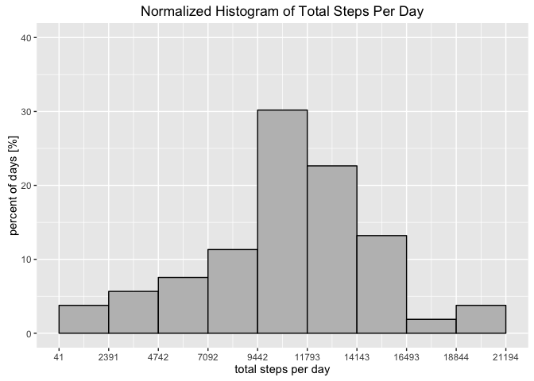

# Reproducible Research: Peer Assessment 1


## Loading and preprocessing the data

File downloaded on: Sat Jan 23 22:13:46 2016

## What is mean total number of steps taken per day?

```r
# Discard row with NAs, group by day, and calculate total steps per day.
dailyActivity <- na.omit(activity) %>% group_by(date) %>%
    summarize(totalSteps = sum(steps))
```




The mean is 10766.19 and the median is 10765
for total number of steps taken per day.

## What is the average daily activity pattern?

```r
intervalActivity <- na.omit(activity) %>% group_by(interval) %>%
    summarize(meanSteps = mean(steps))
```


## Imputing missing values


## Are there differences in activity patterns between weekdays and weekends?
